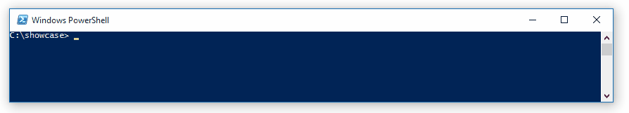
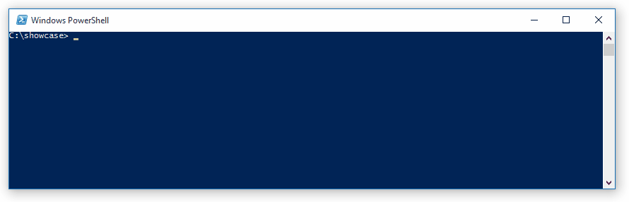

# posh-docker
Powershell tab completion for Docker

## Commands and options
All commands (`start`, `stop`, `run`, ...) and their options (`--attach`, `--cpuset-mems`, ...) are autocompleted.

## Container names
Container names can be autocompleted. Type a command requiring a containername, press `<TAB>` and the name will be completed.

# Installation
*Prerequisite*

Verify that docker can be run from PowerShell. If the command is not found, you will need to add a docker alias or add the docker installation folder (e.g. `%ProgramFiles%\Docker Toolbox`) to your PATH environment variable.

## Windows 10 / Windows Server 2016 
1. Open a powershell prompt
2. Run `Install-Module -Scope CurrentUser posh-docker`

## Earlier Windows versions
1. Install [PackageManagement PowerShell Modules Preview](https://www.microsoft.com/en-us/download/details.aspx?id=49186)
2. Open a powershell prompt
3. Run `Install-Module -Scope CurrentUser posh-docker`

# Usage
After installation, execute the following line to enable autocompletion for the current powershell session:

`Import-Module posh-docker`

To make it persistent, add the above line to your profile. For example, run `notepad $PROFILE` and insert the line above.

## Credits
- Stuart Leeks: conversion to powershell module & general feedback.